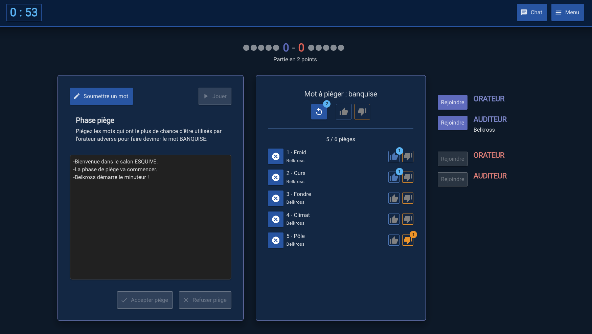

# State of project

This repository is an old version of the project. I’m currently working on a new refactored version with some focus on architecture and testing strategy.

# Esquive

Esquive is a cooperative game where a player have to describe a word to his mates in a given time and they have to guess it. But the opponent team trapped a list of words and using one of them leads to failure. To add some fun and challenge, the player who describe the word can’t have access to the trapped words list.

Live version here: [esquive.belkross.com](https://esquive.belkross.com/)
